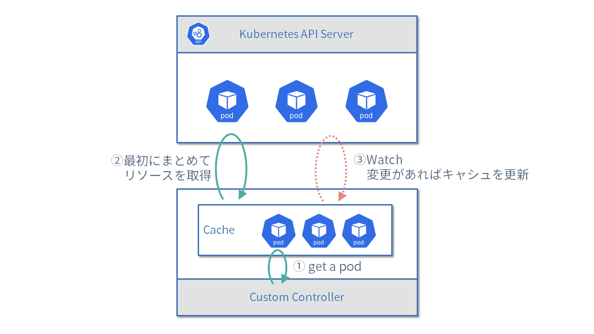

# 如何使用clinet

在实现自定义控制器之前，让我们先了解使用客户端库来访问`Kubernetes API`的方法。

在`controller-runtime`中，提供了用于访问`Kubernetes API`的客户端库 ([client.Client](https://pkg.go.dev/sigs.k8s.io/controller-runtime/pkg/client?tab=doc#Client))。

这个客户端可以同样地处理标准资源和自定义资源，而且使用起来既类型安全又简单。

## 创建客户端

为了创建客户端，首先需要准备一个[Scheme](https://pkg.go.dev/k8s.io/apimachinery/pkg/runtime?tab=doc#Scheme)。

Schema用于Go的struct和GroupVersion之间相互转换，以及不同版本之间进行Schema转换的功能。

在Kububuilder生成的代码中，通常会进行如下初始化处理：

[import:"init"](../../codes/30_client/cmd/main.go)

首先使用`runtime.NewScheme()`创建一个新的`scheme`。
通过`clientgoscheme.AddToScheme`，将 Kubernetes 的标准资源类型，如 Pod 和 Service，添加到`scheme`中。
通过`viewv1.AddToScheme`，将 MarkdownView 自定义资源类型添加到`scheme`中。

通过使用这个`scheme`，可以帮助您创建一个能够处理标准资源和`Markdown View`资源的客户端。

接下来，使用 [GetConfigOrDie](https://pkg.go.dev/sigs.k8s.io/controller-runtime/pkg/client/config?tab=doc#GetConfigOrDie) 获取客户端设置。

[import:"new-manager"](../../codes/30_client/cmd/main.go)

getConfigordie函数可以从一下三个来源读取kubenetes api配置信息。

- `--kubeconfig` 指定命令行选项的配置文件
- 环境变量指定KUBECONFIG
- 如果您是在Kubernetes群集上用作POD运行，请使用服务帐户的自定义控制器的身份验证信息。

自定义控制器通常在 Kubernetes 集群上运行，因此使用服务帐户凭据。

您可以使用此方案和配置创建管理器，并获得使用`getClient()`的客户端。

以下将从`Manager`获得的客户端传递给`MarkdownViewReconciler`，如下所示

[import:"init-reconciler"](../../codes/30_client/cmd/main.go)

但是请注意，在调用`Manager`的`start()`之前，客户端将不可用

## 如何在Reconcile功能中使用客户端

从管理器传递的客户端是MarkdownViewReconciler的嵌入式字段，如下所示。
从 Manager 传递过来的客户端成为 MarkdownViewReconciler 的嵌入字段，如下所示。

[import:"reconciler"](../../codes/30_client/internal/controller/markdownview_controller.go)

因此，在 Reconcile 函数中，您可以调用“r.Get(...)”和“r.Create(...)”等客户端方法。

此外，当使用客户端处理标准 Kubernetes 资源（例如deploymnet和service）时，请设置要使用的资源的组版本。
您需要导入适当的包。
例如，deployment需要“k8s.io/api/apps/v1”包，service需要“k8s.io/api/core/v1”包。

但是，如果按原样导入，包名称`v1`会发生冲突，因此
通常使用`import appsv1 "k8s.io/api/apps/v1`之类的别名进行导入。

本页上的示例使用以下导入。

[import:"import"](../../codes/30_client/internal/controller/markdownview_controller.go)

## Get/List

我们来看看如何使用客户端获取资源。

### Get方法

要获取相关资源，请在第二个参数中指定所需资源的命名空间和名称，如下所示。
然后，您可以在指定为第三个参数的变量中接收结果。
根据作为第三个参数传递的变量的类型自动确定要获取的资源的类型。

[import:"get"](../../codes/30_client/internal/controller/markdownview_controller.go)

### 客户端缓存机制

Kubernetes 上运行着许多控制器，每个控制器处理许多资源。
如果这些控制器每次都访问API服务器并获取资源，就会存在API服务器及其后端etcd的负载增加的问题。

因此controller-runtime提供的客户端有缓存机制。
当此客户端使用`Get()`或`List()`检索资源时，它会检索同一命名空间中的所有同类资源并将它们缓存在内存中。
然后，它会监视目标资源，并在 API 服务器上发生资源更改时更新缓存。



这种缓存机制可以减少控制器对 API 服务器的访问。

而且，由于它有这样的缓存机制，所以即使在实现中只调用Get，也需要List和Watch作为资源访问权限。
如[生成RBAC清单](../controller-tools/rbac.md)中所述，获取资源时，请务必授予`get、list和watch`权限。

如果不需要缓存机制，可以使用Manager的`GetAPIReader()`来获取不带缓存功能的客户端。

### List方法

列表允许指定条件，并一次检索多个资源。

下面的例子中，通过指定LabelSelector和Namespace来获取资源。注意，如果不指定Namespace，则会获取所有Namespace的资源。

[import:"list"](../../codes/30_client/internal/controller/markdownview_controller.go)

您还可以使用`Limit`和`Continue`执行分页。
在下面的示例中，在一次 API 调用中检索并显示了三个资源。

[import:"pagination"](../../codes/30_client/internal/controller/markdownview_controller.go)

可以使用`.ListMeta.Continue`中的令牌来获取下一个资源。
一旦令牌为空，您就获得了所有资源。

## Create/Update

使用`Create()`创建资源，使用`Update()`更新资源。
例如，可以按如下方式创建部署资源。

[import:"create",unindent:"true"](../../codes/30_client/internal/controller/markdownview_controller.go)

请注意，当资源已存在时调用 Create() 或当资源不存在时调用 Update() 将导致错误。

## CreateOrUpdate

常见的模式是使用`Get()`获取资源，如果资源不存在，则调用`Create()`，如果存在，则调用`Update()`。
因此，控制器运行时提供了一个名为`CreateOrUpdate()`的便捷函数。

[import:"create-or-update",unindent:"true"](../../codes/30_client/internal/controller/markdownview_controller.go)

仅指定传递给该函数第三个参数的对象的name(名称)和namespace(命名空间)（但是，集群资源不需要命名空间）。

如果资源存在，则现有资源的值将设置为第三个参数中传递的变量。
然后，重写作为第四个参数传递的函数中的`svc`变量并执行更新过程。

如果资源不存在，则在执行第四个参数中传入的函数后，将执行资源创建过程。

## Patch

当使用`Update()`或`CreateOrUpdate()`进行更新时，其它程序可能会在获取资源和更新资源之间重写资源，这会导致冲突。
（这称为TOCTTOU：检查时间到使用时间）。

如果尝试更新已经被重写的资源，将会出现以下错误。

```
Operation cannot be fulfilled on deployments.apps "sample": the object has been modified; please apply your changes to the latest version and try again
```

因此，可以通过使用`Patch()`方法，可以仅更新要更改的字段的值，而不发生冲突。

有两种修补方法：使用`client.MergeFrom`和`client.StrategicMergeFrom`以及使用服务器端应用。

`client.MergeFrom` 和 `client.StrategicMergeFrom` 之间的区别在于列表元素的更新方式。
使用`client.MergeFrom`更新列表会使用指定的元素覆盖它，但使用`client.StrategicMergeFrom`，列表将根据`patchStrategy`进行更新。
添加或更新元素。

下面是使用`client.MergeFrom`仅更新`Deployment`副本数量的示例。

[import:"patch-merge"](../../codes/30_client/internal/controller/markdownview_controller.go)

另一方面，Server-Side Apply 是 Kubernetes v1.14 中引入的资源更新方法。
通过使用``.metadata.managedFields`管理更新资源每个字段的组件，
您可以在服务器端检测资源更新冲突。

服务器端应用通过准备非结构化补丁来更新资源，如下所示。

另外，如[官方文档中所述](https://kubernetes.io/docs/reference/using-api/server-side-apply/#using-server-side-apply-in-a-controller) 至,
建议在自定义控制器上执行服务器端应用时始终启用`Force`选项。

[import:"patch-apply"](../../codes/30_client/internal/controller/markdownview_controller.go)

由于Server-Side Apply 使用了 Unstructured 类型，因此无法编写类型安全的代码。

`ApplyConfiguration`是在`Kubernetes v1.21`中引入的，现在可以编写类型安全的Server-Side-Apply代码，如下所示。

[import:"patch-apply-config"](../../codes/30_client/internal/controller/markdownview_controller.go)

## Status.Update/Patch

如果将状态（Status）改为子资源（Subresource），就不能使用先前介绍的 `Update()` 或 `Patch()` 来更新状态了。

需要使用专门用于更新状态的客户端。`Status().Update()` 和 `Status().Patch()` 的用法与主资源的 `Update()`、`Patch()` 相同。以下是更改`status`字段并调用 `Status().Update()` 的示例代码。（此代码仅用作示例，不应擅自修改 Deployment 资源的状态。）

[import:"update-status"](../../codes/30_client/internal/controller/markdownview_controller.go)

## Delete/DeleteAllOf

让我们最后看一下用于删除资源的 `Delete` 和 `DeleteAllOf`。

`Delete` 和 `DeleteAllOf` 都具有名为 `Preconditions` 的特殊选项。
以下代码是一个使用了 `Preconditions` 选项的示例：

[import:"cond"](../../codes/30_client/internal/controller/markdownview_controller.go)

在删除资源时，可能会在获取资源后和发送删除请求之间重新创建同名的其他资源。
在这种情况下，如果仅指定 Name 和 Namespace 调用 Delete，可能会导致意外删除重新创建的资源。
因此，在这个示例中，为了避免意外删除重新创建的资源，使用了 `Preconditions` 选项，以匹配 UID 和 ResourceVersion 并删除相应的资源。

`DeleteAllOf` 可以批量删除指定类型的资源，如下所示。

[import:"delete-all-of"](../../codes/30_client/internal/controller/markdownview_controller.go)

但需要注意，并非所有资源都可以使用 `DeleteAllOf`，例如 Service 资源。
