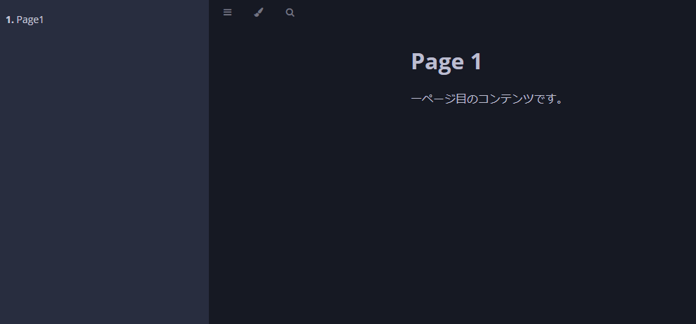

# Reconcile

Reconcile是自定义控制器的核心逻辑。它会比较用户创建的自定义资源的期望状态和实际系统状态，如果存在差异，就会执行必要的处理来填补这些差异。

## Reconciler调协机制

### Reconciler接口

Reconcile实现是通过实现controller-runtime的[reconcile.Reconciler](https://pkg.go.dev/sigs.k8s.io/controller-runtime/pkg/reconcile?tab=doc#Reconciler)接口来实现的。

```go
type Reconciler interface {
	Reconcile(context.Context, Request) (Result, error)
}
```

[reconcile.Request](https://pkg.go.dev/sigs.k8s.io/controller-runtime/pkg/reconcile?tab=doc#Request)参数中包含了此`Reconciler`所针对的自定义资源的`Namespace`和`Name`。

[reconcile.Result](https://pkg.go.dev/sigs.k8s.io/controller-runtime/pkg/reconcile?tab=doc#Result) 的返回值中有两个字段，即 `Requeue` 和 `RequeueAfter`。
如果将`Requeue`设置为`True`并返回该结果，那么`Reconcile`过程将被放入队列中再次执行。
如果指定了`RequeueAfter`，则在指定的时间后重新执行`Reconcile`过程。

此外，如果`Reconcile`返回错误，`Reconcile`过程也将被放入队列中再次执行，但每次失败后等待的时间会按指数增加。

由于 `Reconcile`管理多个资源，不应该花费太多时间来处理单个资源。
如果存在任何等待情况，应该立即退出`Reconcile`，并指定 `Requeue` 或 `RequeueAfter`。


### Reconcile执行时间

Reconcile处理在以下时间点被调用：

* 当控制器处理的资源被创建、更新或删除时
* 当Reconcile失败并且请求再次排队时
* 当控制器启动时
* 当外部事件发生时
* 当缓存重新同步时（默认为每10个小时一次）

由于Reconcile会在各个时机被调用，因此Reconcile处理必须是幂等的（即在多次使用相同请求调用时产生相同结果）。

默认情况下，Reconcile处理被限制为每秒不超过10次执行。

此外，如果这些事件以高频率发生，则可以配置Reconciliation Loop以并行运行。

### 控制受监视对象

上面已提到当控制器处理的资源被创建、更新或删除时，将调用Reconcile处理。
为指定以及过滤“控制器处理的资源”，可使用[NewControllerManagedBy](https://pkg.go.dev/sigs.k8s.io/controller-runtime/pkg/builder#ControllerManagedBy)函数。


[import:"managedby",unindent:"true"](../../codes/40_reconcile/internal/controller/markdownview_controller.go)

#### For

`For`函数指定此控制器Reconcile的目标资源类型。

在这种情况下，我们指定MarkdownView自定义资源。
这意味着当创建、修改或删除MarkdownView资源时，将调用Reconcile函数。
传递给Reconcile函数的请求将包含有关MarkdownView的信息。

值得注意的是，`For`中只能指定一种资源类型。

#### Owns

`Owns`函数指定此控制器创建的资源类型。与`For`不同，`Owns`允许多个指定。

由于MarkdownView控制器创建ConfigMap、Deployment和Service资源，因此我们在`Owns`中指定了这些资源。

通过这种设置，当由MarkdownView控制器创建的资源（ConfigMap、Deployment、Service）发生更改时，将调用Reconcile函数。但是，控制器创建的资源的`ownerReferences`必须将MarkdownView资源指定为所有者。有关如何设置`ownerReferences`的更多详细信息，请参阅[资源删除](./deletion.md)。

当Reconcile由`Owns`中指定的资源更改触发时，Request中将不包含`Owns`中指定资源的名称。而是将包含拥有这些资源的MarkdownView资源的名称。

## Reconcile的实现

现在，让我们实现Reconcile函数的核心部分。

### Reconcile处理流程

让我们概述Reconcile处理的一般流程。

[import:"reconcile",unindent:"true"](../../codes/40_reconcile/internal/controller/markdownview_controller.go)

Reconcile函数利用作为参数传递的Request来检索Reconcile处理的MarkdownView资源。

如果MarkdownView资源不存在，则表示MarkdownView资源已被删除。应执行清理操作，如删除指标，并退出函数。

接下来，函数检查`DeletionTimestamp`。如果不为零，则表示已开始目标资源的删除。在这种情况下，应立即退出函数。

随后，`reconcileConfigMap`、`reconcileDeployment`和`reconcileService`函数分别处理ConfigMap、Deployment和Service资源的创建和更新。

最后，调用`updateStatus`来更新MarkdownView资源的状态。

```go
func (r *MarkdownViewController) Reconcile(req reconcile.Request) (reconcile.Result, error) {
    // 检索MarkdownView资源
    // 处理资源删除
    // 处理资源删除时间戳
    // 调解ConfigMap、Deployment、Service
    // 更新状态
}
```

### reconcileConfigMap

在`reconcileConfigMap`中，根据MarkdownView资源中指定的Markdown内容创建ConfigMap资源。

[import:"reconcile-configmap"](../../codes/40_reconcile/internal/controller/markdownview_controller.go)

```go
func (r *MarkdownViewController) reconcileConfigMap(markdownView *v1alpha1.MarkdownView) error {
    // 在这里创建ConfigMap资源
}
```

### reconcileDeployment, reconcileService

在`reconcileDeployment`、`reconcileService`中，分别创建Deployment和Service资源。

虽然类似于`reconcileConfigMap`，也可以使用`CreateOrUpdate`来创建资源，但是由于Deployment和Service资源具有较多字段，因此检测到差异并更新资源可能会有些麻烦。

因此，我们将采用服务端应用(Server-Side Apply)方式使用[ApplyConfiguration](./client.md)创建资源。

[import:"reconcile-deployment"](../../codes/40_reconcile/internal/controller/markdownview_controller.go)

[import:"reconcile-service"](../../codes/40_reconcile/internal/controller/markdownview_controller.go)

### 更新状态

最后，更新MarkdownView资源的状态以通知用户相关状况。

[import:"update-status"](../../codes/40_reconcile/internal/controller/markdownview_controller.go)

在这里，我们会检查通过`reconcileDeployment`创建的Deployment资源的状态，并根据其状态确定MarkdownView资源的状态。

## 操作验证

完成Reconcile处理的实现后，让我们进行操作验证。
按照[验证自定义控制器](../kubebuilder/kind.md)中的步骤部署自定义控制器，并应用示例的MarkdownView资源。

确认Deployment、Service、ConfigMap资源已经生成，并且MarkdownView资源的状态显示为Healthy。

```
$ kubectl get deployment,service,configmap
NAME                                         READY   UP-TO-DATE   AVAILABLE   AGE
deployment.apps/viewer-markdownview-sample   1/1     1            1           177m

NAME                                 TYPE        CLUSTER-IP     EXTERNAL-IP   PORT(S)   AGE
service/viewer-markdownview-sample   ClusterIP   10.96.162.90   <none>        80/TCP    177m

NAME                                      DATA   AGE
configmap/markdowns-markdownview-sample   2      177m

$ kubectl get markdownview markdownview-sample
NAME                  REPLICAS   STATUS
markdownview-sample   1          Healthy
```

接下来，进行端口转发以从本地环境访问创建的服务。

```
$ kubectl port-forward svc/viewer-markdownview-sample 3000:80
```

最后，在浏览器中访问`http://localhost:3000`。如果看到Markdown呈现在页面中，表示操作验证成功。


