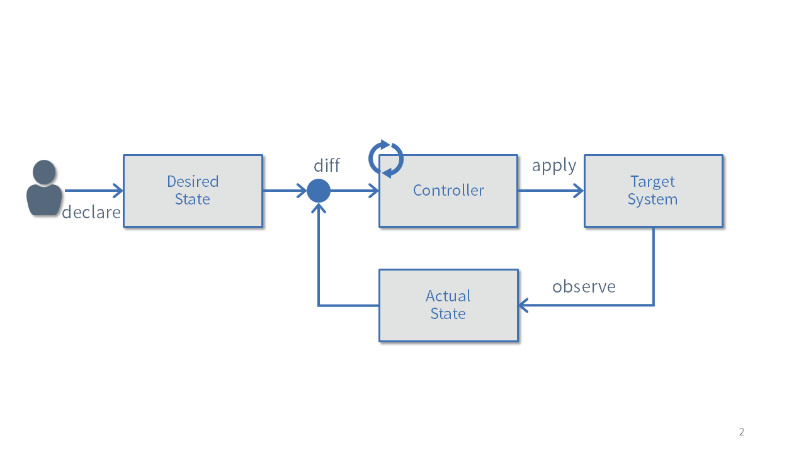
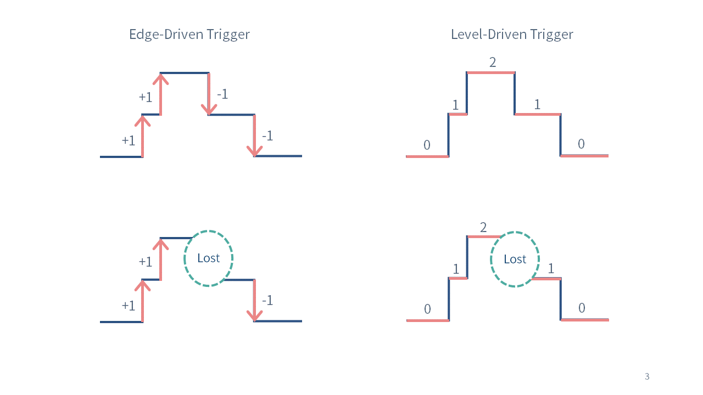

# 自定义开发控制器的基础知识

本节介绍了开发自定义控制器所需的Kubernetes的基本知识。

## 申明式（Declarative）

Kubernetes中最重要的概念是声明性的API。

例如，如果要在kubernetes上部署nginx，我们只需要通过如下YAML格式中描述的清单并创建部署资源。

```yaml
apiVersion: apps/v1
kind: Deployment
metadata:
  name: nginx-deployment
spec:
  selector:
    matchLabels:
      app.kubernetes.io/name: nginx
  replicas: 3
  template:
    metadata:
      labels:
        app.kubernetes.io/name: nginx
    spec:
      containers:
      - name: nginx
        image: nginx:latest
```


在`Kubernetes`中，有管理各种资源的控制器。
比如`Deployment`资源在`kube-apiserver`上注册时，管理`Deployment`的控制器会创建一个新的`ReplicaSet`资源。
接下来，当注册`ReplicaSet`资源时，管理`ReplicaSet`的控制器会创建在`spec.replicas`中指定的三个新 Pod。
此外，当`Pod`资源在`kube-apiserver`上注册时，一个名为`kube-scheduler`的程序会确定`Pod`将被放置的节点并更新`Pod`信息。
每个节点上运行的名为`kubelet`的程序在找到具有其节点名称的`Pod`资源时会启动一个容器。


例如我们可以通过Deployment资源的`Spec.Replicas'字段来控制pod数量，可以增加或者减少`spec.replicas`来减少或增加pod。

这样，在`Kubernetes`中，多个程序根据用户声明的清单协同工作，并调整系统使其处于所需的状态（在本例中，三个`Nginx`实例正在运行）。


通过使用声明式而非命令式（Imperative）机制，运行在 Kubernetes 上的应用程序可以实现高可用性和可扩展性。
然而，控制器的实现可能非常困难，因为它必须考虑各种情况。


## CRD(Custom Resource Definition)和CR(Custom Resource)


`Kubernetes`附带许多标准资源，比如`Deployments`和`Pod`。
虽然在某种程度上使用标准资源构建系统是可能的，例如，如果你想在`Kubernetes`上自动化证书颁发或`MySQL`集群管理，你将需要自定义开发控制器。

因此，提供了自定义资源`（CR）`作为`Kubernetes`用户自由使用新资源的机制
为了使用自定义资源，您需要准备 `CRD`（自定义资源定义）作为其定义。`CRD`允许您以`OpenAPI v3.0`格式编写验证，如下所示

- [CRD实例](https://github.com/zoetrope/kubebuilder-training/blob/main/codes/50_completed/config/crd/bases/view.zoetrope.github.io_markdownviews.yaml)

## 自定义控制器

在 Kubernetes 中，检查资源状态并执行某些处理的程序称为控制器。
例如，一个控制器正在基于`Deployment`资源创建`ReplicaSet`资源。

如果您查看Kubernetes源代码，您会发现有许多与标准资源相对应的控制器。

- https://github.com/kubernetes/kubernetes/tree/master/pkg/controller

相比之下，用户定义的自定义资源控制器称为自定义控制器。

下面，我们将介绍实现控制器时的重要概念。

### Reconciliation Loop

Reconciliation Loop协调循环是自定义控制器的主要逻辑。

将资源中描述的状态与系统当前的状态进行比较，并进行调整以消除差异。



在前面的部署实例中，资源定义的是三个pod，协调循环（Reconciliation Loop）通过增加或者减少pod的数量来匹配理想状态来处理该协调过程。


### 冪等

Reconciliation Loop(协调循环)必须是幂等的。

比如我们之前的示例中pod的控制器，如果这个控制器被申明为3个pod，那么无论调用多少次的Reconcicle,pod的数量都始终保持是3。当存在3个pod，再次调用reconcile时，不应在创建三个pod或有任何报错信息。

显而易见，在kubernetes中，通过命令式基础设施自动化工具通常不是幂等的。

### 水平触发和边缘触发

`Reconciliation Loop`是指在资源被新注册或编辑时，或者目标资源的状态发生变化时，必须进行适当的处理。
例如，在前述的例子中，如果`Deployment`资源中描述的副本数增加，或者由于服务器故障导致 Pod 数量减少时，则需要创建新的 Pod。

在这种情况下，根据状态变化事件执行处理被称为边缘触发器，根据当前状态执行处理被称为水平触发。

- 水平触发: 定期检查各个集群内各种对象的状态，如果满足某种条件（例如pod running 状态），对应的handler就一直触发一些动作。

- 边缘触发: 当某些对象发生了状态改变（例如pod 从running到不健康状态，从没有pod到创建出一个pod），在改变的时刻对应的handler会触发一个行为。


([参考](https://hackernoon.com/level-triggering-and-reconciliation-in-kubernetes-1f17fe30333d))



如图所示，如果`Reconciliation Loop`仅关注事件（例如`Replica`数量的增减），那么如果由于某些原因（例如控制器故障）导致事件丢失，期望状态和当前状态就会不一致。
另一方面，如果关注的是当前状态（例如当前的Replica数量），即使事件丢失，也能够使状态收敛到期望状态。

`Kubebuilder`提供的框架中，当各种事件发生时会调用`Reconciliation Loop`。
但是，此时`Reconciliation Loop`不会接收到值如何变化的信息。
必须检查当前状态，并根据该状态实现相应的处理。
通过这种机制，可以实现对事件丢失和故障具有较强容错能力的控制器。
