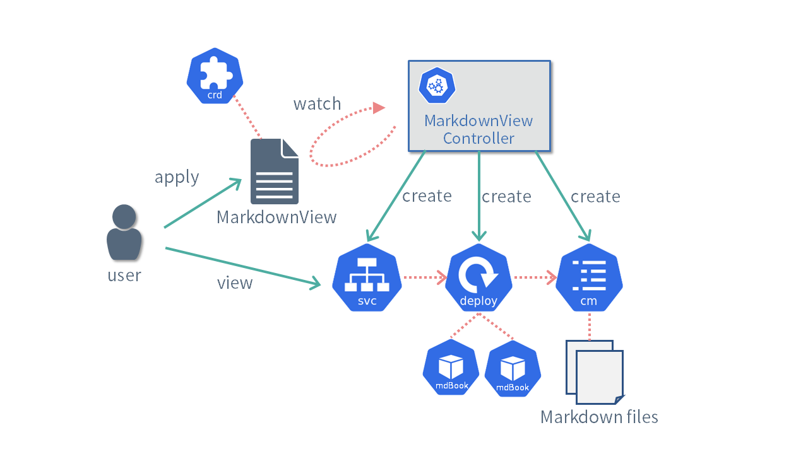

# MarkdownView控制器

本文档将实施一个名为`MarkdownView`的自定义控制器作为示例。MarkdownView 控制器提供了一个服务，用于渲染用户提供的 Markdown 并使其可以在浏览器中查看。

我们将使用`mdBook`来进行`Markdown`的渲染。

- https://rust-lang.github.io/mdBook/

`MarkdownView`控制器的主要处理流程如下所示。



- 用户创建`MarkdownView`自定义资源。
- MarkdownView 控制器根据创建的`MarkdownView`资源的内容，创建必要的各种资源。
  - 将自定义资源中描述的`Markdown`创建为`ConfigMap`资源。
  - 创建用于渲染`Markdown`的`mdBook`作为`Deployment`资源。
  - 创建用于访问`mdBook`的`Service`资源。
- 用户可以通过创建的服务访问并查看渲染后的`Markdown`内容。

`MarkdownView`自定义资源可以指定以下内容:`Markdown`的内容、用于渲染的`mdBook`容器镜像以及副本数。

[import](../../codes/50_completed/config/samples/view_v1_markdownview.yaml)

以下是参考源代码，请参考

- https://github.com/zoetrope/kubebuilder-training/tree/main/codes

目录结构如下所示：

```
codes
├── 00_scaffold:  Kubebuilder生成的代码
├── 10_tilt:      添加使用`Tilt`设置开发环境的步骤
├── 20_manifests: 生成`CRD`, `RBAC`, `Webhook`的清单
├── 30_client:    添加客户端库使用示例
├── 40_reconcile: 实现`Reconcile`过程和`Webhook`
└── 50_completed: 添加Finalizer(终结处理)、Recoder(记录器)、监控的代码
```
